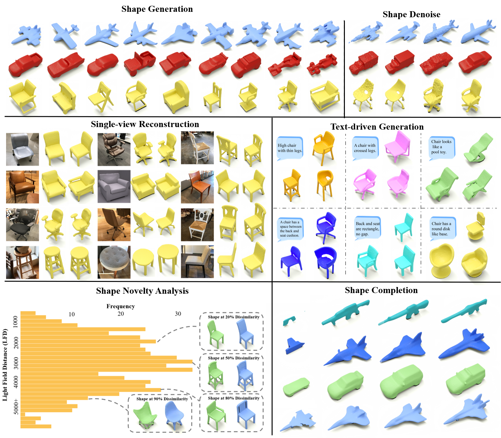
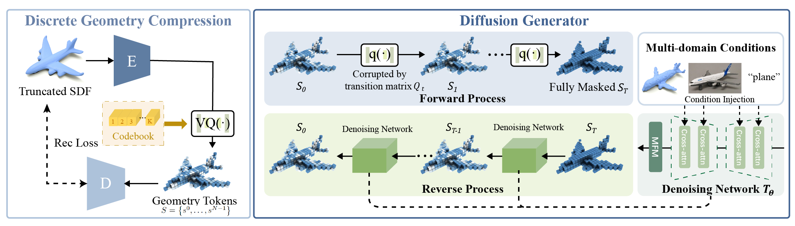

# 3DQD: Generalized Deep 3D Shape Prior via Part-Discretized Diffusion Process<br><sub><sub>Official PyTorch implementation of the CVPR 2023 paper</sub></sub>
[[`arXiv`](https://arxiv.org/abs/2303.10406)]
[[`BibTex`](#citation)]



# Introduction
[**3DQD: Generalized Deep 3D Shape Prior via Part-Discretized Diffusion Process**](https://arxiv.org/abs/2303.10406)<br>
Yuhan Li, Yishun Dou, Xuanhong Chen, Bingbing Ni, Yilin Sun, Yutian Liu and Fuzhen Wang

**[abstract]** *3DQD is a generalized 3D shape generation prior model, tailored for multiple 3D tasks including unconditional shape generation, point cloud completion, and crossmodality shape generation, etc. 3DQD first learns a compact representation with P-VQ-VAE for its advantages in computational saving and consistency among
different tasks. Then a novel discrete diffusion generator is trained with accurate, expressive and diversified object structural modeling. Multi-frequency fusion modules are developed to suppress high-frequency outliers.*



# Demo
We plan to release demo to show the all of extended applications of our model. 
```
Comming soom!
```


# Installation

- Python >= 3.8
- CUDA 11.1
- Pytorch >= 1.9
- Pytorch3D
- trimesh
- tqdm
- scipy
- tensorboard
- PyMCubes

Or you can setup the environment using `conda`:
```
conda env create -f environment.yaml
conda activate 3dqd
```

(Optional) Some packages are also need to evaluate generated shapes.
- clip >= 1.0 (The pretrained clip model `ViT-B-32.pt` can be download [here](https://drive.google.com/drive/folders/1_CUhSU7sAmMWoHwzkJO0yeRjAJ5KhNNr?usp=sharing))
- light-field-distance == 0.0.9
- Frechet Pointcloud Distance  (Following the instructions from [TreeGAN](https://github.com/jtpils/TreeGAN))
- Pytorch Chamfer Distance
- PyTorchEMD
```
cd metrics/pvd_metrics/PyTorchEMD
python setup.py install
cp build/**/emd_cuda.cpython-38-x86_64-linux-gnu.so .
```


# Pretrained Models
Pre-trained models are available [here](https://drive.google.com/drive/folders/1_CUhSU7sAmMWoHwzkJO0yeRjAJ5KhNNr?usp=sharing).  
The download the pre-trained models from the provided links should be put into the `./saved_ckpt` folder.

# Preparing the Data
We follow the instructions from [AutoSDF](https://github.com/yccyenchicheng/AutoSDF) to preprocess data.

1. [ShapeNet](https://www.shapenet.org)

First you need to download the `ShapeNetCore.v1` following the instruction of `https://www.shapenet.org/account/`. 

To extract SDF values, we followed the [preprocessing steps from DISN](https://github.com/laughtervv/DISN).

2. [ShapeGlot](https://github.com/optas/shapeglot)  

```
cd {dataroot}   # Here is your own Dataroot
git clone https://github.com/optas/shapeglot

# Follow the instructions from ShapeGlot to download the shape-text pairs data.
# You need first finish a questionnaire in https://github.com/optas/shapeglot. 
# Then you will recieve a link and put it into the file 'download_data.sh'.

cd shapeglot/
./download_data.sh
```

3. (Optional for single-view reconstruciton)[Pix3D](https://github.com/xingyuansun/pix3d)

The Pix3D dataset can be downloaded here: https://github.com/xingyuansun/pix3d.

**The layout should look like this**
```
├── 3DQD
├── dataset [This is your dataroot]
│   ├── ShapeGlot
│   ├── ShapeNet
│   │   ├── 20691156
│   │   │   ├── *****************
│   │   │   │   ├── ori_sample.h5
│   │   ├── 20747177
│   │   ├── filelists
│   │   │   ├── 20691156_test.lst
│   │   │   ├── 20691156_train.lst
│   │   ├── SDF_v1_64
│   │   │   ├── 20691156
│   │   │   │   ├── *****************
│   │   │   │   │   ├── ori_sample.h5       
│   ├── extracted_code [This folder will be generated after excute ./launchers/extract_pvqvae_snet.sh]
│   |   ├── pvqvae-snet-all-T0.2
│   |   |   ├── 20691156
│   |   │   │   ├── *****************
│   |   │   │   │   ├── code.npy
│   |   │   │   │   ├── codeix.npy
│   |   │   │   │   ├── x.npy
```


# Evaluating
We offer three kinds of scripts to evaluate the trained model. Every script will produce a logger `log.txt` to record your hyperparameter settings and metrics during evaluating.

```
# To evaluating models for unconditional generation.
python evaluation_scripts/eval_uncond.py --cat {car|airplane|chair} --ckpt {MODEL_PATH}

# To evaluating models for shape completion.
python evaluation_scripts/eval_shape_comp.py --ckpt {MODEL_PATH} --comp_type {half|octant}

# To evaluating models for text-driven generation.
python evaluation_scripts/eval_textdf.py --ckpt {MODEL_PATH}
```


# Training
The whole training has two stages, which means the **P-VQ-VAE** and **discrete diffusion generator** are trained **seperately**.

1. First train the `P-VQ-VAE` on `ShapeNet`:
```
./launchers/train_pvqvae_snet.sh
```

After training, copy the trained `P-VQ-VAE` checkpoint (`pretrained-vqvae-snet.ckpt`) to the `./saved_ckpt folder`. Based on this quantized feature representation of shape, diffusion models on various tasks can be trained.

2. Then extract the code for each sample of ShapeNet (caching them for training the diffusion):
```
./launchers/extract_pvqvae_snet.sh
```

3. Train the diffusion models for various tasks:
```
 # Tarin the discrete diffusion generator on 13 categories in Shapenet for shape completion.
./launchers/train_comp_df_snet_code.sh  

# Tarin the discrete diffusion generator on single(car|chair|airplane) category for unconditional generation.
./launchers/train_uncond_df_snet_code.sh

# Tarin the discrete diffusion generator on chair category for text-driven generation.
./launchers/train_textdf_shapeglot.sh
```


# <a name="citation"></a>Citing 3DQD

If you find our work useful to your research, please consider citing:

```BibTeX
@misc{2303.10406,
Author = {Yuhan Li and Yishun Dou and Xuanhong Chen and Bingbing Ni and Yilin Sun and Yutian Liu and Fuzhen Wang},
Title = {3DQD: Generalized Deep 3D Shape Prior via Part-Discretized Diffusion Process},
Year = {2023},
Eprint = {arXiv:2303.10406},
}
```

# Acknowledgement
This code borrowed heavily from [AutoSDF](https://github.com/yccyenchicheng/AutoSDF), [VQ-DIFF](https://github.com/microsoft/VQ-Diffusion) and [LDM](https://github.com/CompVis/latent-diffusion). Thanks for their great work!
